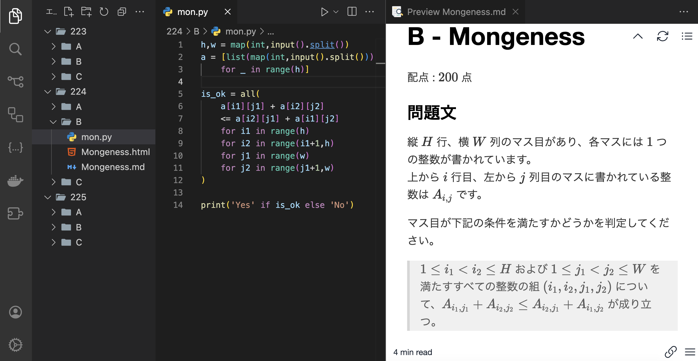

# AtCoderStudyBooster

## 概要

AtCoderStudyBoosterはAtCoderの学習を加速させるためのツールです。問題をローカルにダウンロードし、テスト、解答の作成をサポートするツールです。Pythonが入っていることが必須です。Pythonが入っている環境なら、`pip install AtCoderStudyBooster`でインストールできます。

このツールは以下のプロジェクトに強く影響を受けています。
[online-judge-tools](https://github.com/online-judge-tools)
[atcoder-cli](https://github.com/Tatamo/atcoder-cli)
これらとの違いですが、本ツールはAtCoderでのコンテストでの利用は想定しておらず、初心者の学習のサポートのみを意識しています。そのため、現時点で提出機能は備えていません。また, Chat GPT APIによる解答の作成サポート機能を備えています。

## 利用ケース

### B問題の練習したい場合

ABCコンテストの223から226のB問題だけを集中的に練習したい場合、次のコマンドを実行します。

```sh
atcdr download B 223..226
```

コマンドを実行すると,次のようなフォルダーを作成して、各々のフォルダーに問題をダウンロードします。

```css
B
├── 223
│   ├── StringShifting.html
│   └── StringShifting.md
├── 224
│   ├── Mongeness.html
│   └── Mongeness.md
├── 225
│   ├── StarorNot.html
│   └── StarorNot.md
└── 226
    ├── CountingArrays.html
    └── CountingArrays.md
```

MarkdownファイルあるいはHTMLファイルをVS CodeのHTML Preview, Markdown Previewで開くと問題を確認できます。VS Codeで開くと左側にテキストエディターを表示して、右側で問題をみながら問題に取り組めます。



### サンプルをローカルでテストする

問題をダウンロードしたフォルダーに移動します。

```sh
cd B/224
```

移動したフォルダーで解答ファイルを作成後を実行すると, 自動的にテストします。

```sh
▷ ~/.../B/224
atcdr t
```

```sh
solution.pyをテストします。
--------------------

Sample 1 of Test:
✓ Accepted !! Time: 24 ms

Sample 2 of Test:
✓ Accepted !! Time: 15 ms
```

と実行すると作成したソースコードをテストして、HTMLに書かれているテストケースを読み込んで実行し, Passするかを判定します。

## 解答生成機能generateコマンドに関する注意点

本ツールにはChatGPT APIを利用したコード生成機能があります。[AtCoder生成AI対策ルール](https://info.atcoder.jp/entry/llm-abc-rules-ja?_gl=1*1axgs02*_ga*ODc0NDAyNjA4LjE3MTk1ODEyNDA.*_ga_RC512FD18N*MTcyMzMxNDA1Ni43NC4xLjE3MjMzMTY1NjUuMC4wLjA.)によるとAtCoder Beginner Contestにおいてに問題文を生成AIに直接与えることは禁止されています。ただし、このルールは過去問を練習している際には適用されません。

現時点で本ツールにはログイン機能がないため、コンテスト中の問題に対して`download`コマンドは利用して問題をダウンロードすることはできません。`generate`コマンドは`download`コマンドに依存しており、ダウンロードした問題のHTMLファイルをパースしてGPTに解釈しやすいmarkdownを与えることで実現しています。したがって、このコマンドがAtCoder Beginner Contest中に[AtCoder生成AI対策ルール](https://info.atcoder.jp/entry/llm-abc-rules-ja?_gl=1*1axgs02*_ga*ODc0NDAyNjA4LjE3MTk1ODEyNDA.*_ga_RC512FD18N*MTcyMzMxNDA1Ni43NC4xLjE3MjMzMTY1NjUuMC4wLjA.)に抵触することはありません。
