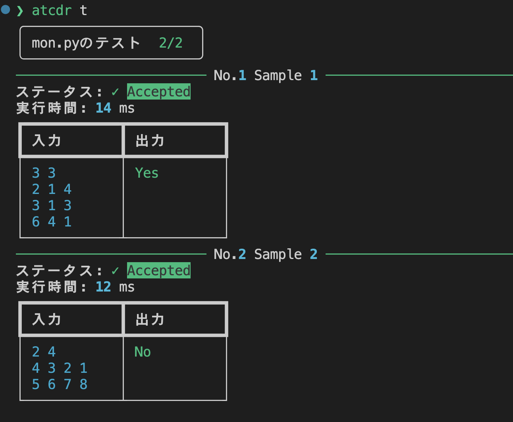
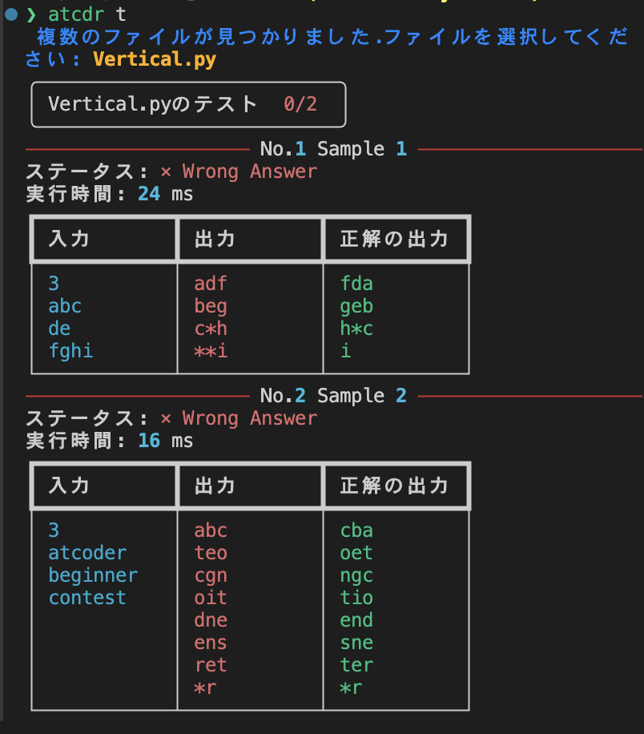
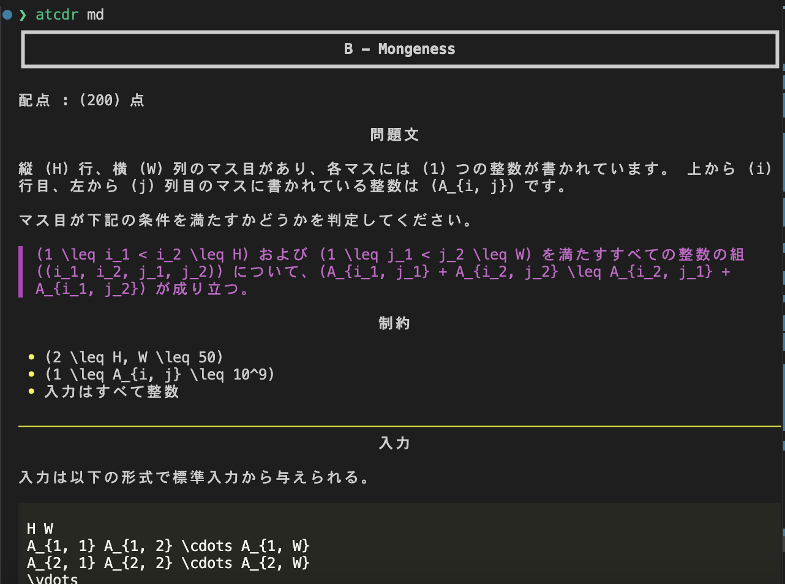

# AtCoderStudyBooster

## 概要

AtCoderStudyBoosterはAtCoderの学習を加速させるためのツールです。問題をローカルにダウンロードし、テスト、解答の作成をサポートするツールです。Pythonが入っていることが必須です。Pythonが入っている環境なら、`pip install AtCoderStudyBooster`でインストールできます。

このツールは以下のプロジェクトに強く影響を受けています。
[online-judge-tools](https://github.com/online-judge-tools)
[atcoder-cli](https://github.com/Tatamo/atcoder-cli)
これらとの違いですが、本ツールはAtCoderでのコンテストでの利用は想定しておらず、初心者の学習のサポートのみを意識しています。そのため、現時点で提出機能は備えていません。また, Chat GPT APIによる解答の作成サポート機能を備えています。

## 利用ケース

### B問題の練習したい場合

ABCコンテストの223から226のB問題だけを集中的に練習したい場合、次のコマンドを実行します。

```sh
❯ atcdr download B 223..226
```

コマンドを実行すると,次のようなフォルダーを作成して、各々のフォルダーに問題をダウンロードします。

```css
B
├── 223
│   ├── StringShifting.html
│   └── StringShifting.md
├── 224
│   ├── Mongeness.html
│   └── Mongeness.md
├── 225
│   ├── StarorNot.html
│   └── StarorNot.md
└── 226
    ├── CountingArrays.html
    └── CountingArrays.md
```

### 特定のコンテストの問題に取り組みたい場合

```sh
❯ atcdr download 223..225 A..C
```
のように実行すると以下のようなフォルダーを生成します.

```css
.
├── 223
│   ├── A
│   │   ├── ExactPrice.html
│   │   └── ExactPrice.md
│   ├── B
│   │   ├── StringShifting.html
│   │   └── StringShifting.md
│   └── C
│       ├── Doukasen.html
│       └── Doukasen.md
├── 224
│   ├── A
│   │   ├── Tires.html
│   │   └── Tires.md
│   ├── B
│   │   ├── Mongeness.html
│   │   └── Mongeness.md
│   └── C
│       ├── Triangle.html
│       └── Triangle.md
└── 225
    ├── A
    │   ├── DistinctStrings.html
    │   └── DistinctStrings.md
    ├── B
    │   ├── StarorNot.html
    │   └── StarorNot.md
    └── C
        ├── CalendarValidator.html
        └── CalendarValidator.md
```

### 問題を解く

MarkdownファイルあるいはHTMLファイルをVS CodeのHTML Preview, Markdown Previewで開くと問題を確認できます。VS Codeで開くと左側にテキストエディターを表示して、右側で問題をみながら問題に取り組めます。


### サンプルをローカルでテストする

問題をダウンロードしたフォルダーに移動します。

```sh
❯ cd 224/B
```

移動したフォルダーで解答ファイルを作成後をtestコマンドを実行すると, サンプルケースをテストします。

```sh
~/.../224/B
❯ atcdr t
```



WAの場合は以下のような表示になります。




### 提出する

```sh
~/.../224/B
❯ atcdr open
```
を実行すると、デフォルトのブラウザーで問題のページをを開きます。AtCoderのサイトで問題を確認したい場合や解答を提出したい場合にこのコマンドを利用しましょう。


### 解答をGPTで生成する

```sh
~/.../224/B
❯ atcdr g
```
で解答をGPTで生成します。Chat GPTのAPIキーが必要です。さらに、生成されたファイルはサンプルケースが自動でテストされ、**テストをパスしなかった場合、テスト結果がGPTにフィードバックされ解答が再生成**されます。

GPTとプログラムとのやり取りのログはJSONファイルで保存されます。また, APIの推定利用料金もプリントします。

## 解答生成機能generateコマンドに関する注意点

[AtCoder生成AI対策ルール](https://info.atcoder.jp/entry/llm-abc-rules-ja?_gl=1*1axgs02*_ga*ODc0NDAyNjA4LjE3MTk1ODEyNDA.*_ga_RC512FD18N*MTcyMzMxNDA1Ni43NC4xLjE3MjMzMTY1NjUuMC4wLjA.)によるとAtCoder Beginner Contestにおいてに問題文を生成AIに直接与えることは禁止されています。ただし、このルールは過去問を練習している際には適用されません。

現時点で本ツールにはログイン機能がないため、コンテスト中の問題に対して`download`コマンドは利用して問題をダウンロードすることはできません。`generate`コマンドは`download`コマンドに依存しており、ダウンロードした問題のHTMLファイルをパースしてGPTに解釈しやすいmarkdownを与えることで実現しています。したがって、このコマンドがAtCoder Beginner Contest中に[AtCoder生成AI対策ルール](https://info.atcoder.jp/entry/llm-abc-rules-ja?_gl=1*1axgs02*_ga*ODc0NDAyNjA4LjE3MTk1ODEyNDA.*_ga_RC512FD18N*MTcyMzMxNDA1Ni43NC4xLjE3MjMzMTY1NjUuMC4wLjA.)に抵触することはありません。

## その他の機能

### markdownコマンド

完全なCLI環境方向けのコマンドです。
```sh
~/.../224/B
❯ atcdr md
```
を実行すると, 問題をプリントします。



### 複数のファイルを一度にテスト

```sh
~/.../224/B
❯ atcdr t *.py
```
でフォルダー内にあるすべてのPythonファイルを一度にテストします。
```sh
~/.../224/B
❯ atcdr t mon.py mon.c mon.cpp
```

フォルダー内に複数ファイルある場合は、インタラクティブに選択できます。
```sh
~/.../224/B
❯ atcdr t
```

```sh
~/.../224/B
❯ atcdr t
 複数のファイルが見つかりました.ファイルを選択してください:
 十字キーで移動, [enter]で実行
 ❯❯❯ mon.py
     mon.c
     mon.cpp
```

### プログラミング言語を指定してコードを生成

`--lang`オプションを使うと、生成したいプログラミング言語を指定できます。
```sh
~/.../224/B
❯ atcdr generate --lang rust
```
### テストをせずにコードのみ生成

デフォルトで`atcdr generate`コマンドは生成されたコードをテストしますが、テストせずにコードのみ生成できます。

```sh
~/.../224/B
❯ atcdr generate --lang rust --without_test
```
